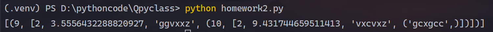
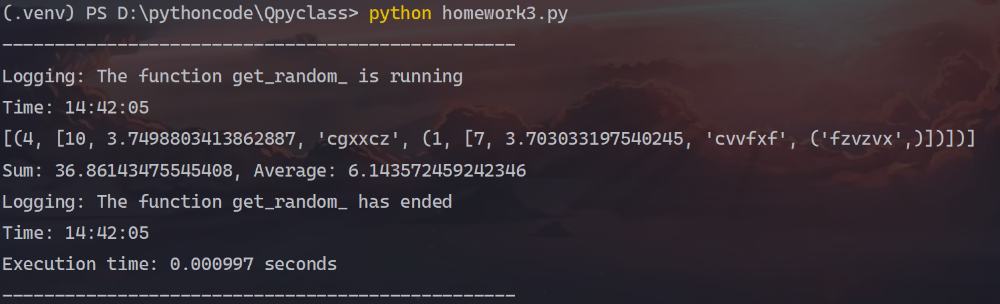
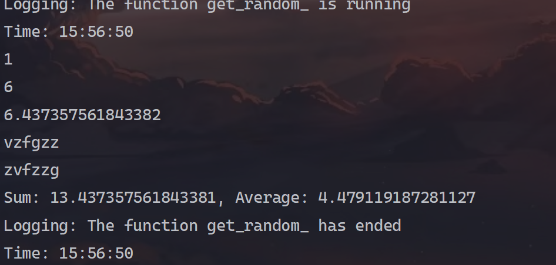

# Python期末作业

*  **Name:** 钱卓雲
*  **Class:** 东北师范大学2024春Python程序设计
* **Email:** qianzhuoyun@nenu.edu.cn
* **Version:** 1.0.1

**Version problem:** 目前来看，作业1+2没有问题。作业1+2这部分可以拓展为随意数据结构都能生成随机数。作业4这里无法正常打印出，求得的average和sum没有任何问题。之后可能会对代码进行修改。还有一点，这个图片我不想改路径了，反正也不多，虽然看着不整齐，但是也能看（对不起！/sad）。

## 作业1+2：类封装 + 随机数生成

这部分我记得老师说的是第一个作业是写一个随机数生成函数，第二个是对随机数生成函数进行一个类封装，我将这两个合并在一起。

当前的代码仅仅接受以下格式的输入！

测试样例：

```python
my_dict = {'tuple': {'int': {'datarange': [1, 10]},
                         'list': {
                             'int': {'datarange': [1, 10]},
                             'float': {'datarange': [1, 10]},
                             'str': {'datarange': "gfzxcv", "datalength": 6},
                             'tuple': {'str': {'datarange': "gfzxcv", "datalength": 6}},
                             'tuple': {'int': {'datarange': [1, 10]},
                                       'list': {
                                           'int': {'datarange': [1, 10]},
                                           'float': {'datarange': [1, 10]},
                                           'str': {'datarange': "gfzxcv", "datalength": 6},
                                           'tuple': {'str': {'datarange': "gfzxcv", "datalength": 6}}
                                       }}
                         }}
    }
```

测试结果：




源代码：

```python
from functools import wraps
import random

class RandomDataGenerator:
    def __init__(self):
        pass

    def get_random(self, **kwargs):
        result = []
        for key, value in kwargs.items():
            if key == 'tuple':
                result.append(tuple(self.get_random(**value)))
            elif key == 'list':
                result.append(list(self.get_random(**value)))
            elif key == 'set':
                result.append(set(self.get_random(**value)))
            elif key == 'int':
                a, b = value['datarange']
                result.append(random.randint(a, b))
            elif key == 'float':
                a, b = value['datarange']
                result.append(random.uniform(a, b))
            elif key == 'str':
                datarange = value["datarange"]
                datalength = value["datalength"]
                result.append(''.join(random.choice(datarange) for _ in range(datalength)))
            else:
                print("This is an undefined type")
                result.append("********")
        return result

if __name__ == "__main__":
    gen = RandomDataGenerator()
    my_dict = {'tuple': {'int': {'datarange': [1, 10]},
                         'list': {
                             'int': {'datarange': [1, 10]},
                             'float': {'datarange': [1, 10]},
                             'str': {'datarange': "gfzxcv", "datalength": 6},
                             'tuple': {'str': {'datarange': "gfzxcv", "datalength": 6}},
                             'tuple': {'int': {'datarange': [1, 10]},
                                       'list': {
                                           'int': {'datarange': [1, 10]},
                                           'float': {'datarange': [1, 10]},
                                           'str': {'datarange': "gfzxcv", "datalength": 6},
                                           'tuple': {'str': {'datarange': "gfzxcv", "datalength": 6}}
                                       }}
                         }}
    }
    print(gen.get_random(**my_dict))

```


## 作业3：用类修饰器修饰随机数生成函数

这里我是写了类修饰器其功能如下：

1. 对生成的随机数中最小单元求和，和求均值。这里的最小单元指int，float类型的数。
2. 记录每次程序运行的开始时间和结束时间
3. 计算程序运行时间


测试样例：

```python
my_dict = {'tuple': {'int': {'datarange': [1, 10]},
                         'list': {
                             'int': {'datarange': [1, 10]},
                             'float': {'datarange': [1, 10]},
                             'str': {'datarange': "gfzxcv", "datalength": 6},
                             'tuple': {'str': {'datarange': "gfzxcv", "datalength": 6}},
                             'tuple': {'int': {'datarange': [1, 10]},
                                       'list': {
                                           'int': {'datarange': [1, 10]},
                                           'float': {'datarange': [1, 10]},
                                           'str': {'datarange': "gfzxcv", "datalength": 6},
                                           'tuple': {'str': {'datarange': "gfzxcv", "datalength": 6}}
                                       }}
                         }}
    }
```

运行截图：



源代码：

```python
from functools import wraps
import random
import time

class RandomDataGenerator:
    def __init__(self):
        pass

    def use_logging(func):
        @wraps(func)
        def wrapper(self, *args, **kwargs):
            print('-------------------------------------------------')
            start_time = time.time()  # 获取开始时间
            print(f"Logging: The function {func.__name__} is running")
            print(f"Time: {time.strftime('%X', time.localtime())}")
            result = func(self, *args, **kwargs)
            end_time = time.time()  # 获取结束时间
            print(f"Logging: The function {func.__name__} has ended")
            print(f"Time: {time.strftime('%X', time.localtime())}")
            print(f"Execution time: {end_time - start_time:.6f} seconds")
            print('-------------------------------------------------')
            return result
        return wrapper


    def get_element(self, data, out_list = None):
        if(out_list == None):
            out_list = []
        for item in data:
            if isinstance(item, (int, float)):
                out_list.append(item)
            elif isinstance(item, (list, set, tuple)):
                self.get_element(item, out_list=out_list)
        return out_list

    def calculate_sum_and_average(func):
        @wraps(func)
        def wrapper(self, *args, **kwargs):
            result = func(self, *args, **kwargs)
            data_ = self.get_random(**kwargs)
            number_list = self.get_element(data_, None)
            cont_number = len(number_list)
            sum = 0
            average = 0
            for num in number_list:
                sum += num
            if cont_number != 0:
                average = sum/cont_number
            print(f"Sum: {sum}, Average: {average}")
            return result
        return wrapper

    def get_random(self, **kwargs):
        result = []
        for key, value in kwargs.items():
            if key == 'tuple':
                result.append(tuple(self.get_random(**value)))
            elif key == 'list':
                result.append(list(self.get_random(**value)))
            elif key == 'set':
                result.append(set(self.get_random(**value)))
            elif key == 'int':
                a, b = value['datarange']
                result.append(random.randint(a, b))
            elif key == 'float':
                a, b = value['datarange']
                result.append(random.uniform(a, b))
            elif key == 'str':
                datarange = value["datarange"]
                datalength = value["datalength"]
                result.append(''.join(random.choice(datarange) for _ in range(datalength)))
            else:
                print("This is an undefined type")
                result.append("********")
        return result

    @use_logging
    @calculate_sum_and_average
    def get_random_(self, **kwargs):
        print(self.get_random(**kwargs))

if __name__ == "__main__":
    gen = RandomDataGenerator()
    my_dict = {'tuple': {'int': {'datarange': [1, 10]},
                         'list': {
                             'int': {'datarange': [1, 10]},
                             'float': {'datarange': [1, 10]},
                             'str': {'datarange': "gfzxcv", "datalength": 6},
                             'tuple': {'str': {'datarange': "gfzxcv", "datalength": 6}},
                             'tuple': {'int': {'datarange': [1, 10]},
                                       'list': {
                                           'int': {'datarange': [1, 10]},
                                           'float': {'datarange': [1, 10]},
                                           'str': {'datarange': "gfzxcv", "datalength": 6},
                                           'tuple': {'str': {'datarange': "gfzxcv", "datalength": 6}}
                                       }}
                         }}
               }
    gen.get_random_(**my_dict)

```

## 作业4：用yeild返回生成的随机数

在实际工程中，可能需要生成大量的随机数，导致无法一次性存储到内存空间中，那么此时需要yeild，迭代返回值。

测试样例：

```python
my_dict = {'tuple': {'int': {'datarange': [1, 10]},
                         'list': {
                             'int': {'datarange': [1, 10]},
                             'float': {'datarange': [1, 10]},
                             'str': {'datarange': "gfzxcv", "datalength": 6},
                             'tuple': {'str': {'datarange': "gfzxcv", "datalength": 6}},
                             'tuple': {'int': {'datarange': [1, 10]},
                                       'list': {
                                           'int': {'datarange': [1, 10]},
                                           'float': {'datarange': [1, 10]},
                                           'str': {'datarange': "gfzxcv", "datalength": 6},
                                           'tuple': {'str': {'datarange': "gfzxcv", "datalength": 6}}
                                       }}
                         }}
    }
```

运行截图：



代码：

```python
from functools import wraps
import random
import time

class RandomDataGenerator:
    def __init__(self):
        pass

    def use_logging(func):
        @wraps(func)
        def wrapper(self, *args, **kwargs):
            print('-------------------------------------------------')
            start_time = time.time()  # 获取开始时间
            print(f"Logging: The function {func.__name__} is running")
            print(f"Time: {time.strftime('%X', time.localtime())}")
            result = func(self, *args, **kwargs)
            end_time = time.time()  # 获取结束时间
            print(f"Logging: The function {func.__name__} has ended")
            print(f"Time: {time.strftime('%X', time.localtime())}")
            print(f"Execution time: {end_time - start_time:.6f} seconds")
            print('-------------------------------------------------')
            return result
        return wrapper


    def get_random(self, **kwargs):
        # Modified to be a generator function using yield
        for key, value in kwargs.items():
            if key == 'tuple':
                for item in self.get_random(**value):
                    yield item
            elif key == 'list':
                for item in self.get_random(**value):
                    yield item
            elif key == 'set':
                for item in self.get_random(**value):
                    yield item
            elif key == 'int':
                a, b = value['datarange']
                yield random.randint(a, b)
            elif key == 'float':
                a, b = value['datarange']
                yield random.uniform(a, b)
            elif key == 'str':
                datarange = value["datarange"]
                datalength = value["datalength"]
                yield ''.join(random.choice(datarange) for _ in range(datalength))
            else:
                print("This is an undefined type")
                yield "********"

    def get_element(self, data):
        out_list = []
        for item in data:
            if isinstance(item, (int, float)):
                out_list.append(item)
            elif isinstance(item, (list, set, tuple)):
                self.get_element(item, out_list)  # Pass the out_list to be filled
        return out_list

    @use_logging
    def get_random_(self, **kwargs):
        number_list = []
        sum = 0
        for item in self.get_random(**kwargs):
            print(item)  # Print each generated random number
            if isinstance(item, (int, float)):
                number_list.append(item)
                sum += item
        count = len(number_list)
        average = sum / count if count != 0 else 0
        print(f"Sum: {sum}, Average: {average}")
if __name__ == "__main__":
    gen = RandomDataGenerator()
    my_dict = {'tuple': {'int': {'datarange': [1, 10]},
                         'list': {
                             'int': {'datarange': [1, 10]},
                             'float': {'datarange': [1, 10]},
                             'str': {'datarange': "gfzxcv", "datalength": 6},
                             'tuple': {'str': {'datarange': "gfzxcv", "datalength": 6}}
                         }}}
    gen.get_random_(**my_dict)

```

